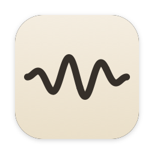
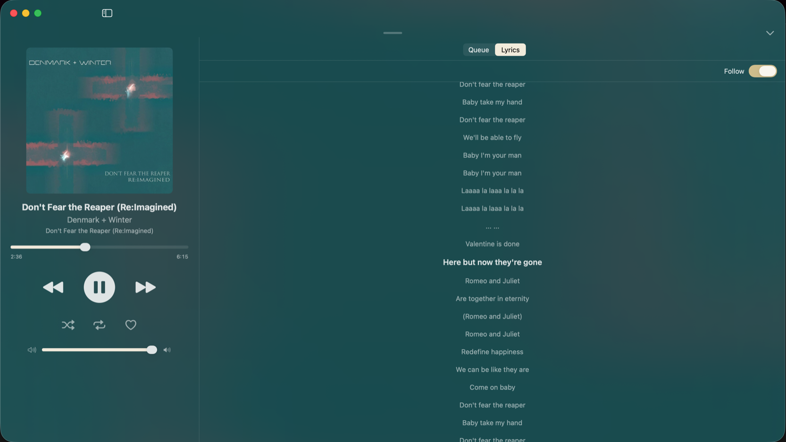
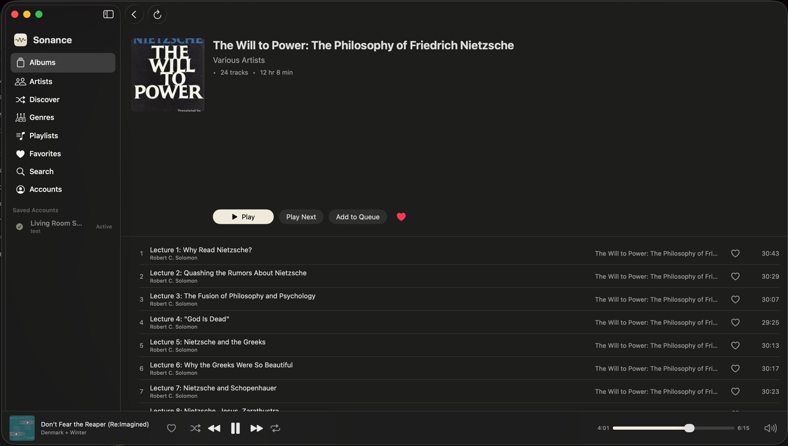
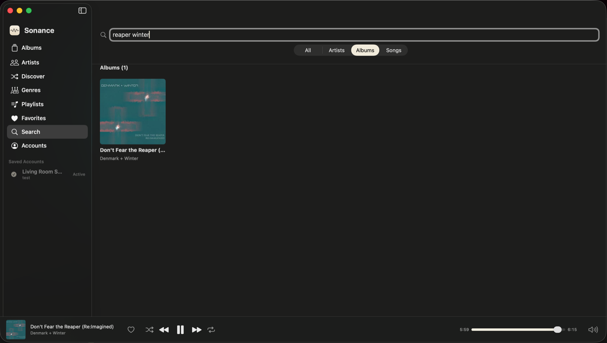

<div align="center">



# Sonance

A macOS client for Navidrome and other Subsonic-compatible servers.

</div>

<p align="center">
  <a href="https://github.com/AlanHuang99/sonance/actions/workflows/ci.yml"></a>
  <a href="LICENSE"></a>
  <a href="https://github.com/AlanHuang99/sonance/releases/latest"></a>
  
</p>

<p align="center">
  
</p>

Sonance is a native SwiftUI music client for [Navidrome](https://www.navidrome.org/) and other Subsonic / OpenSubsonic-compatible servers. It streams from a server you run; it does not host a library of its own.

## Features

### Library

- Sidebar sections: Albums, Artists, Discover, Genres, Playlists, Favorites, Search, Accounts.
- Albums grid with pagination (100 per page) and a sort menu (A–Z, Newest, Recently Played, Most Played, Random). Keyboard-selected tiles auto-scroll to stay visible.
- Album detail groups tracks by disc on multi-disc releases; the disc header shows the per-disc track count and duration. The album header shows total track count and duration.
- Artist detail shows the artist image and biography from `getArtistInfo2` (when available), a similar-artists strip, and Play All / Shuffle All over the whole discography.
- Discover tab: random Songs / Albums / Artists / Playlists, refreshed on demand.
- Genres tab: grid of genre cards backed by `getGenres`, drilling into `getAlbumList2(type: byGenre)`.
- Smart playlists (Navidrome `.nsp`) are read-only. Regular playlists support create, rename, delete, drag-to-reorder, and add tracks via search.
- Favorites for songs, albums, and artists.
- Debounced search across artists, albums, and songs with an All / Artists / Albums / Songs scope picker.
- Synced lyrics via OpenSubsonic `getLyricsBySongId`; click a line to seek.
- Artist and album names are clickable links throughout track lists, the album header, the Now Playing pane, and the queue. A hover underline marks the affordance.

### Playback

- `AVQueuePlayer` with gapless transitions: the next track is preloaded when the current one is within 10 s of its end.
- Queue: Play, Play Next, Add to Queue, Reorder, Remove, Clear.
- Shuffle. Repeat (Off / All / One).
- Scrobbling: now-playing on start, submission at 50 % or 4 minutes.
- Queue, playhead, shuffle, repeat, and volume are persisted across launches.

### macOS integration

- `MPNowPlayingInfoCenter` and `MPRemoteCommandCenter`: Control Center, the menu-bar Now Playing widget, media keys, AirPods double-tap, Control Center scrubbing, and the system repeat/shuffle controls all see and steer playback.
- Optional menu-bar status item with a mini transport popover.
- Closing the window does not quit the app.
- In-app updates via Sparkle: a "Check for Updates…" item under the app menu downloads, verifies, installs, and relaunches the new version. Available in the directly-distributed build (see [Distribution channels](#distribution-channels)).

### Mini-player and Now Playing

- Bottom mini-player: cover, title and artist, transport, scrubber, volume.
- Click the mini-player cover to open the Now Playing panel (large cover, transport, queue, lyrics).
- Click the title or artist in the mini-player to navigate to that album or artist.
- Drag a track from any list onto the Now Playing queue to insert at that position.

### Keyboard shortcuts

- Space — play / pause
- ⌘P — play / pause
- ⌘← / ⌘→ — previous / next
- ⌘F — focus search
- ⌘1..⌘6 — sidebar sections (Albums, Artists, Discover, Genres, Playlists, Favorites)
- ⌘L — open the current track's album
- ↑ / ↓ + Return in track lists
- ← / → / ↑ / ↓ + Return in the albums grid

### Persistence

- Credentials in macOS Keychain (`UserDefaults` in Debug builds).
- Queue, playhead, shuffle / repeat / volume in `UserDefaults`.

### Not implemented

- Smart-playlist (`.nsp`) editing — requires editing the `.nsp` file or Navidrome's web UI. The Subsonic API does not expose rule editing.
- Sleep timer.
- AirPlay.

## Screenshots

<p align="center">
  
  <br>
  <em>Album detail — tracks grouped by disc, with Play / Play Next / Add to Queue.</em>
</p>

<p align="center">
  
  <br>
  <em>Debounced search across artists, albums, and songs, with a scope picker.</em>
</p>

## Requirements

- macOS 14 (Sonoma) or later.
- A [Navidrome](https://www.navidrome.org/) server, or another Subsonic / OpenSubsonic-compatible server.

## Install

Download the latest `Sonance-vX.Y.Z.dmg` from the [Releases page](https://github.com/AlanHuang99/sonance/releases/latest), open it, and drag Sonance to Applications. Release builds are signed with a Developer ID certificate and notarized by Apple, so they open without Gatekeeper warnings.

After the first install the app updates itself: choose **Sonance ▸ Check for Updates…**, or leave automatic checks on. See [Distribution channels](#distribution-channels) for how that works.

## Build from source

```sh
brew install xcodegen
xcodegen generate
open Sonance.xcodeproj
```

Command-line Debug build (ad-hoc signing, no certificate required):

```sh
xcodegen generate
xcodebuild \
  -project Sonance.xcodeproj \
  -scheme Sonance -configuration Debug \
  -destination 'platform=macOS' \
  -derivedDataPath build \
  build

open build/Build/Products/Debug/Sonance.app
```

Run tests:

```sh
xcodebuild -project Sonance.xcodeproj -scheme Sonance \
  -destination 'platform=macOS' \
  -derivedDataPath build test
```

Build-and-run helper: `./scripts/dev.sh`. See [DEVELOPMENT.md](DEVELOPMENT.md) for more.

## Tech stack

| Area | Uses |
|------|------|
| UI | SwiftUI |
| Audio | AVFoundation (`AVQueuePlayer`) |
| System integration | MediaPlayer (`MPNowPlayingInfoCenter`, `MPRemoteCommandCenter`) |
| Credentials | macOS Keychain |
| Updates | [Sparkle](https://sparkle-project.org) (direct builds only) |
| Project generation | [XcodeGen](https://github.com/yonaskolb/XcodeGen) |
| Server API | Subsonic / OpenSubsonic |

## Distribution channels

There are two application targets, sharing the same sources, product name, and bundle id:

- **`Sonance`** — the base target. No Sparkle. This is the build intended for a future Mac App Store submission (the App Store provides updates and forbids self-updating code).
- **`Sonance-Direct`** — the directly-distributed build (GitHub Releases). Adds Sparkle for in-app updates, the `SPARKLE` compilation condition, the Sparkle feed/key Info.plist entries, and `Sonance-Direct.entitlements` (the base sandbox plus the two mach-lookup exceptions Sparkle's sandboxed installer needs). Updater code is gated behind `#if SPARKLE`, so the base target compiles without it and never links the framework.

Default local/dev builds use the `Sonance` scheme. Build `Sonance-Direct` to exercise the updater. The release pipeline ships `Sonance-Direct`.

## Releases

Releases are cut from Git tags by GitHub Actions. Pushing a tag like `v0.6.0` builds the `Sonance-Direct` target, signs it with a Developer ID Application certificate, notarizes it with Apple, and publishes `Sonance-vX.Y.Z.dmg` and `Sonance-vX.Y.Z.zip` to the Releases page. It then signs the zip with Sparkle's EdDSA key and updates `appcast.xml` on the GitHub Pages branch, which is the update feed the app polls (`SUFeedURL`).

```sh
git tag v0.6.0
git push origin v0.6.0
```

The required repository secrets and the one-time signing-key setup are documented in [DEVELOPMENT.md](DEVELOPMENT.md#releases-and-signing).

Local unsigned Release build and DMG:

```sh
./scripts/build-release-app.sh 0.6.0-local 1
./scripts/make-dmg.sh build/Build/Products/Release/Sonance.app build/Sonance-local.dmg
```

## Project layout

```
Sonance/
  SonanceApp.swift          @main; hosts Auth, Player, FavoritesStore,
                            LibraryStore, NavigationCoordinator.
  ContentView.swift         Login vs. library routing; mini-player + Now Playing.
  AppDelegate.swift         Status item, popover, keep-running-on-close.
  Auth/                     ServerCredentials, AuthStore, KeychainHelper.
  Networking/               SubsonicClient, SubsonicError, NetworkDiagnostics.
  Library/                  LibraryStore (shared cache + de-duplication),
                            NavigationCoordinator.
  Models/                   Subsonic response types.
  Playback/
    Player.swift            AVQueuePlayer wrapper, queue, gapless preload.
    NowPlayingCenter.swift  Bridge to MPNowPlayingInfoCenter and
                            MPRemoteCommandCenter.
    CoverArtCache.swift     Two-tier (memory + disk) cover-art cache.
    FavoritesStore.swift    Star / unstar state.
    PlaybackQueueLogic.swift  Pure queue mutations (used by Player and tests).
  Updates/
    UpdaterController.swift Sparkle wrapper (gated behind #if SPARKLE).
  Views/                    SwiftUI views.
  Assets.xcassets/          AppIcon (generated by tools/make_icon.swift),
                            AccentColor.
  Sonance.entitlements      Sandbox + network client (base / App Store target).
  Sonance-Direct.entitlements  Base entitlements + Sparkle mach-lookup exceptions.
  Info.plist                Generated by xcodegen.
SonanceTests/               XCTest target.
scripts/                    dev.sh, build-release-app.sh, sign-app.sh, make-dmg.sh.
tools/make_icon.swift       Icon renderer.
project.yml                 XcodeGen project config.
```

## Subsonic / Navidrome notes

- Auth uses the salted-MD5 token form (`u`, `t`, `s`). Cover-art and stream URLs use a memoized salt+token per `SubsonicClient` so URLs stay stable for the lifetime of a session; other endpoints rotate the salt per call.
- Streaming uses `getStream?id=...` URLs, which `AVPlayer` loads directly.
- Cover art uses `getCoverArt?id=...&size=N`. Sizes used in the app: 96 (mini-player), 300 (grid), 400 (album detail), 600 (Now Playing and system Now Playing artwork). Decoded `NSImage`s are cached in memory (64 MB cap by decoded-pixel cost) and on disk under `~/Library/Caches/com.alanhuang.Sonance/covers/` (200 MB cap, LRU eviction).
- `Info.plist` sets `NSAllowsArbitraryLoads = true` so HTTP-only Navidrome installs on a LAN work. Remove it if your server is HTTPS-only.

## Contributing

Issues and pull requests are welcome. For anything substantial, please open an issue first to discuss the approach. See [CONTRIBUTING.md](CONTRIBUTING.md) for the workflow and [DEVELOPMENT.md](DEVELOPMENT.md) for build, auto-update, and testing details.

## License

Sonance is released under the GNU General Public License v3.0. See [LICENSE](LICENSE).
